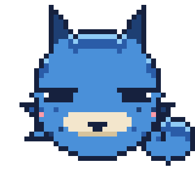
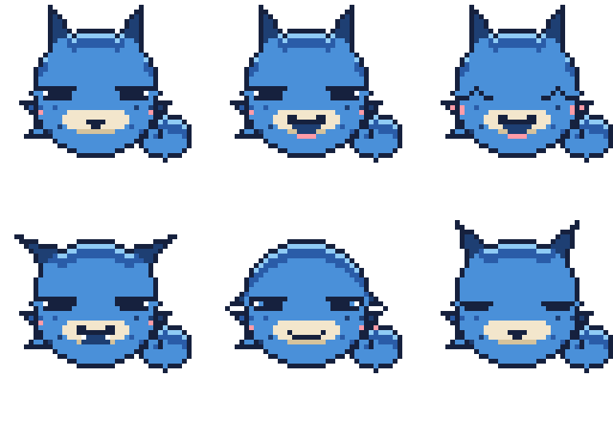
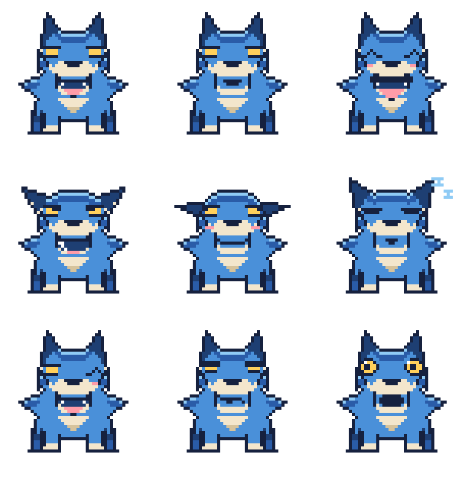
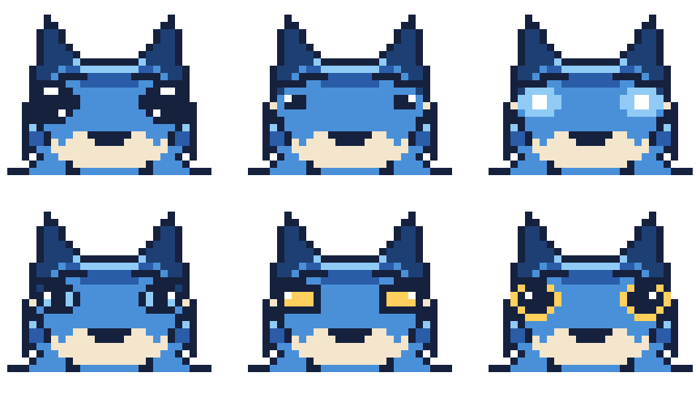
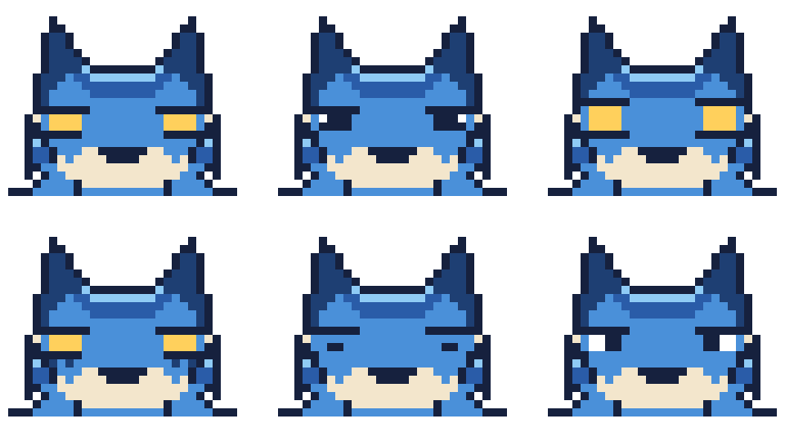
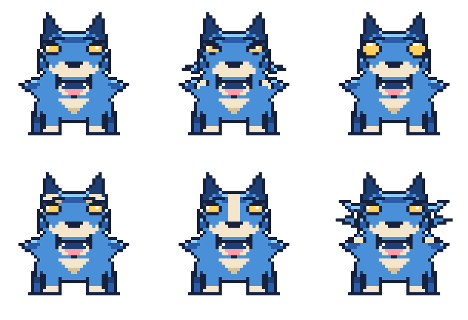
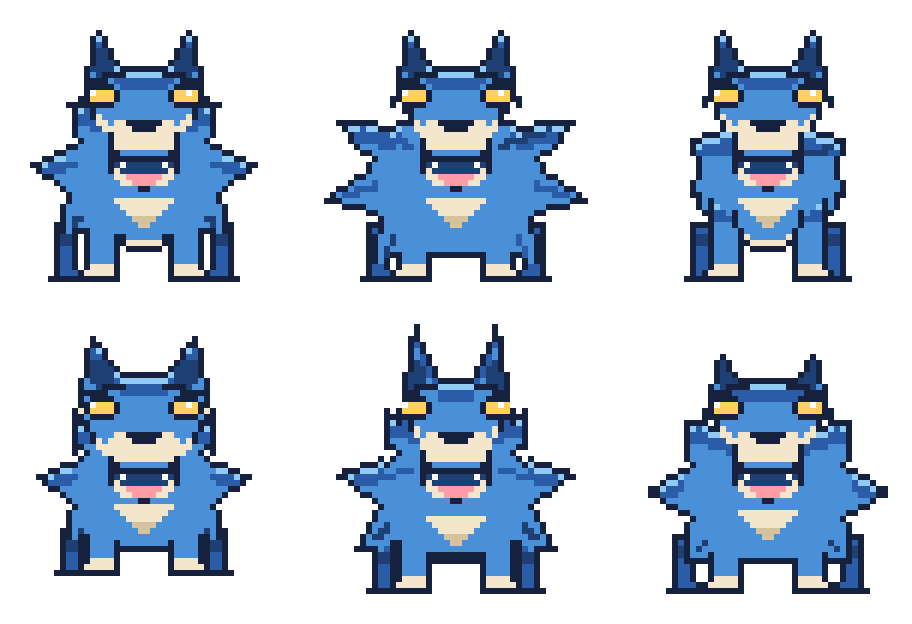

# マスコット（名前未定）

このリポジトリの相棒キャラクター。
**青ベースの狼／ドット絵／四足歩行／凛々しい立ち姿** で進行中。名前はまだ決めていません。

## 本命：四足の狼（48×40）

`pixel/sprite_wolf_quad.txt`

- **頭を背中より高く保った立ち姿。** うつむかせない。凛々しさはほぼこの一点で決まる。
- **金の目。** 差し色の金 `#FFD05C` は目だけに使う。顔の中でいちばん最初に目がいく。
- **耳は立てる。** 伏せると途端に弱く見える。
- **しっぽは上げる。** 垂らすと警戒・服従の姿勢になってしまう。
- **背中は水平に近く、腰でわずかに落ちる。** 背が丸まると老いて見える。
- **首まわりは毛でふくらませる。** 下記のルールで、頭より太い毛のかたまりを作る。

## 毛をふさふさに見せる4つの手順

ドット絵で毛を表現するとき、いちばん効くのは **輪郭そのものをギザギザにすること** です。
内側に線を入れるだけでは毛に見えません。首まわりはこの順で作っています。

1. **土台を置く。** 首を包む丸いかたまりを、首の太さの1.5〜2倍で置く。
   この時点ではただの塊でよい。
2. **毛束を独立した三角形として重ねる。**
   のど・のど下・胸・うなじの4方向に、根元を土台の内側まで食い込ませた三角形を置く。
   根元が土台から離れると穴が空くので、必ず数ピクセル重ねる。
   1房は **根元5〜6px・長さ5〜6px** 。これより小さいと輪郭線に埋もれて消える。
3. **毛先へ向かう1pxの線を引く。** かたまりの中心から各毛先へ、`D` と `N` を交互に。
   長さは中心から毛先までの 30%〜78% の区間だけ。端まで引くと輪郭とぶつかって潰れる。
4. **上側の1pxだけ `L` で光らせる。** 毛の上面に光が乗り、かたまりに丸みが出る。

肩へのつながりは、後ろ向きの毛束を2つ **胴の内側に収まる範囲で** 置いて毛先をぼかします。
胴の輪郭線より外に出すと背中のラインが折れて、毛ではなくトゲに見えてしまいます。

しっぽも同じ手順で、外側の縁に3つ毛束を足しています。

## 正面：吠えるポーズ（48×48）

`pixel/sprite_wolf_front.txt`

 

正面は **直立ポーズでは絶対に盛り上がりません**。左右対称で動きがないぶん、
横向きより情報が少なくなるからです。なので正面は吠えている構えにしています。

### 勢いと怖さは別の場所が作っている

ここが今回いちばんの発見でした。
**逆立った毛は「勢い」だけを担当していて、「怖さ」には一切関係しません。**
怖さは全部、顔のパーツが作っています。
つまり毛はワイルドなままでよく、怖すぎるときは顔だけ直せば済みます。

怖くなる要素（マスコットでは避ける）:

| 避ける | 代わりに |
| --- | --- |
| 吊り上がった細い目 | 丸くて大きい金の目 |
| 目に光がない | **白のハイライトを1px入れる**（これだけで一気に怖くなくなる） |
| 中心に向かって急角度で下がる眉 | 下げるのは2pxまで。決意くらいで止める |
| 下向きに突き出た大きな牙 | 牙は小さく、口角を上げる |
| 後ろに寝た耳 | 前に立てる |

テンションを作っているのは次の3つ。この順に効きます。

1. **開いた口と舌。** ピンクの舌は顔の中で唯一の暖色なので、真っ先に目に入る。
2. **外へ跳ねた毛。** 首の毛を放射状の大きな三角3つ（片側）にして、星形のシルエットを作る。
3. **大きな金の目。** 光を1px入れて生きている目にする。

毛は **片側3房まで** 。5房・6房と増やすと1房が3〜5pxまで痩せて、輪郭が団子になります。
「房を増やす」ではなく「房を大きくする」が正解でした。先を平らにして太らせる手も試しましたが、
階段状のギザギザになってかえって汚くなったので、先は尖らせたままにしています。

左右は片側だけ描いて反転（`sym()`）。手で両側を描くと必ずズレます。

`pixel/sprite_wolf_face.txt` はこの正面から顔だけを切り出した 32×32 で、
アイコンにするならこちらのほうが横顔より目を引きます。

## 1頭身・手足なし（40×40）

頭がそのまま体。手足は付けず、耳と丸いしっぽだけが生えています。
`pixel/sprite_wolf_sd*.txt`（通常・吠える・喜び・怒り・しょんぼり・寝ている）。

丸く見せるのに効いたのは、輪郭を丸くすることではなく **輪郭を四角くしている物を探すこと** でした。
真円で描いていても、次の3つが side を平らにしていました。

1. **首の毛が胴を四角くする。** 毛のかたまりを頭と同じ大きさにすると、
   下半分の左右が壁になります。毛は **下半分だけ・小さめ** に。
2. **耳の付け根が広すぎる。** 付け根が広いと頭の上部左右が垂直になります。
   付け根を2px 詰めるだけで上が丸くなります。
3. **足を下に並べると底が平らになる。** 手足を外したことで底が素直に丸くなりました。

顔のパーツは頭の下半分に寄せています。中央より上に置くと、同じ絵でも一気に大人びます。
しっぽは頭の後ろだと完全に隠れるので、右下に丸い毛玉として出しています。

## 目の色

金（`Y`）をやめて、**目は輪郭と同じ濃紺**に統一しました。
これでキャラの色は青・クリーム・濃紺・桃（ほお／舌）だけになり、暖色は舌とほおだけです。
目には白のハイライトを1px残してあります。これがないと、まぶたの帯と一体化して目が消えます。

`palette.json` の `Y` は使われなくなりましたが、差し色を戻したくなったときのために残してあります。

## 2頭身・正面（48×48／以前の形）

## 表情パターン（9種・ジト目ベース）

目は **ジト目（まぶたの帯＋金の細い線）を基準** にしています。
既定の顔（`sprite_wolf_front.txt`）は口を閉じたジト目です。

| ファイル | 表情 | フィードでの使いどころ |
| --- | --- | --- |
| `pixel/sprite_wolf_front.txt` | ジト目・口を閉じる（既定） | 待機中 |
| `pixel/sprite_wolf_front_bark.txt` | ジト目のまま吠える | 投稿した瞬間 |
| `pixel/sprite_wolf_front_happy.txt` | 喜び | 投稿成功 |
| `pixel/sprite_wolf_front_angry.txt` | 怒り | エラー・失敗 |
| `pixel/sprite_wolf_front_sad.txt` | しょんぼり | 投稿スキップ |
| `pixel/sprite_wolf_front_sleep.txt` | 寝ている | キューが空 |
| `pixel/sprite_wolf_front_wink.txt` | ウインク | 予約完了 |
| `pixel/sprite_wolf_front_smug.txt` | どや顔 | 連続投稿の達成 |
| `pixel/sprite_wolf_front_surprise.txt` | 驚き | 想定外の入力 |

### まぶたの帯を全表情で保つ

ジト目を基準にすると、**まぶたの帯をどの表情でも残すか**が分かれ目になります。
残したほうが同じキャラに見えるので、怒り・しょんぼり・どや顔・ウインクでは帯を保ち、
**傾きだけ変えて**感情を出しています。

| 表情 | まぶたの帯 |
| --- | --- |
| 通常・吠える | 水平 |
| 怒り | 内側（鼻側）が下がる |
| しょんぼり | 外側が下がる |
| どや顔 | 2px に厚くして目を細める |
| 驚き | **帯を外す**（これだけ例外。帯を残すと驚きに見えない） |
| 喜び・寝ている | 目を閉じるので帯なし |

驚きだけ帯を外しているのは、ジト目のままだと「見開いた」感じが出ないからです。
逆に言うと、帯を外すだけで驚きに見えます。

| 耳 | 回転 | 使う表情 |
| --- | --- | --- |
| 立てる | 0° | 通常・吠える・喜び・ウインク・どや顔・驚き |
| 少し寝かせる | -25° | 寝ている |
| 後ろに寝かせる | -45° | 怒り |
| 垂らす | -72° | しょんぼり |

## 目の検討案・第2案：系統を変える（6種）

第1案はどれも「金のアーモンド型」の範囲だったので、系統ごと変えたもの。

| 案 | 目 | 印象 |
| --- | --- | --- |
| `dark` | 大きな黒目＋白のハイライト2つ | 王道のマスコット |
| `dot` | 小さな黒い点目 | 素朴、シンプル |
| `glow` | 輪郭なしで光る（水色＋白の芯） | 神秘的、獣らしい |
| `ice` | 水色の虹彩＋黒い瞳 | 涼しい、地の青となじむ |
| `square` | 四角い目 | レトロ、ドット感が強い |
| `ring` | 金の縁取り＋黒目 | 視線が出る、目力が強い |

## 目の検討案・第3案：ジト目（6種）

まぶたの帯を目の上に置いて潰すのが基本形です。口は閉じています。

| 案 | 目 | 印象 |
| --- | --- | --- |
| `jito` | まぶたの帯＋金の細い線 | 基本形 |
| `jito_dark` | 全部黒で潰す | 無表情、読めない |
| `jito_lid` | 上下のまぶたで挟む | いちばん見やすい |
| `jito_shadow` | 目の下に影の線を2本 | いちばんジトっとする |
| `jito_dot` | まぶたの下に点だけ | 呆れ、真顔 |
| `jito_sclera` | 白目＋瞳を外側に寄せる | 目をそらしている |

ジト目は **目の位置を1px下げる** のが要点でした。
頭の上側は陰（`D`）で暗くしてあるので、目を上に置くとまぶたの帯が陰と同化して消えます。

## 顔立ちの検討案（6種）

体つきと表情（吠える）は揃えて、**顔のパーツそのもの**を変えた比較用です。
`drafts/pixel/face_design_*.txt`。

| 案 | 変えたところ | 印象 |
| --- | --- | --- |
| `A_now` | 現行（丸い金の目） | 素直、扱いやすい |
| `B_sharp` | 細く吊った目＋頬の毛を尖らせる | 精悍、野性的 |
| `C_big` | 目を一回り大きく丸く | かわいい、親しみ |
| `D_brow` | 目の上にクリームの斑（眉斑） | 表情が読みやすい、狼らしい |
| `E_blaze` | 額から鼻筋にクリームの線 | 個体識別しやすい、印象に残る |
| `F_fluff` | 頬に毛の房を追加 | もふもふ、丸い |

顔の模様（`D` `E`）は **クリームで入れると確実に見えます**。
濃紺で隈取りを入れる案も試しましたが、地の青と明度が近く、小さく表示するとほぼ消えました。
青いキャラに模様を足すなら、暗くするのではなく明るくするほうが効きます。

模様（`D` `E`）と頬の毛（`B` `F`）と目のかたち（`A` `B` `C`）は独立しているので、
「`C` の目に `E` の鼻筋」のような組み合わせも作れます。

## 体つきの検討案（6種）

顔（吠える）は揃えて、**毛量と体つきだけ**変えた比較用です。`drafts/pixel/front_shape_*.txt`。

| 案 | 内容 | 向いている印象 |
| --- | --- | --- |
| `base` | 現行 | バランス型 |
| `fluffy` | 毛束4本・毛のかたまりを最大に | もふもふ、存在感 |
| `clean` | 毛束2本・毛を最小に | すっきり、アイコン向き |
| `chibi` | 頭を大きく・脚を短く | かわいい、親しみ |
| `sharp` | 耳を高く・細身・脚を長く | 精悍、スピード感 |
| `heavy` | 胴を太く・腰を広く | どっしり、力強い |

小さく表示するほど `clean` が読みやすく、大きく表示するほど `fluffy` が映えます。
アイコンと投稿画像で使い分けるのも手です。

## 過去案

`drafts/` に以前の案が入っています。

- `tsugimon.svg` / `tsugimon-icon.svg` … 最初のベクター版（テラコッタ色の毛皮）
- `pixel/sprite_b_otter.txt` / `pixel/sprite_c_horn.txt` … デフォルメ3案のうち採用しなかった2案
