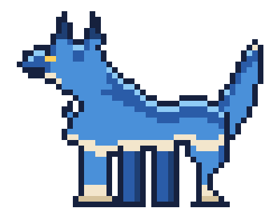
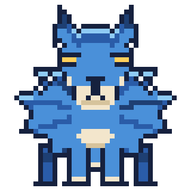
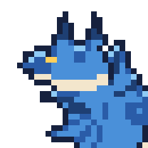
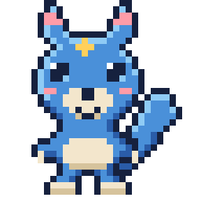

# マスコット（名前未定）

このリポジトリの相棒キャラクター。
**青ベースの狼／ドット絵／四足歩行／凛々しい立ち姿** で進行中。名前はまだ決めていません。



## 本命：四足の狼（48×40）

`pixel/sprite_wolf_quad.txt`

- **頭を背中より高く保った立ち姿。** うつむかせない。凛々しさはほぼこの一点で決まる。
- **金の目。** 差し色の金 `#FFD05C` は目だけに使う。顔の中でいちばん最初に目がいく。
- **耳は立てる。** 伏せると途端に弱く見える。
- **しっぽは上げる。** 垂らすと警戒・服従の姿勢になってしまう。
- **背中は水平に近く、腰でわずかに落ちる。** 背が丸まると老いて見える。
- **首まわりは毛でふくらませる。** 下記のルールで、頭より太い毛のかたまりを作る。

## 毛をふさふさに見せる4つの手順

ドット絵で毛を表現するとき、いちばん効くのは **輪郭そのものをギザギザにすること** です。
内側に線を入れるだけでは毛に見えません。首まわりはこの順で作っています。

1. **土台を置く。** 首を包む丸いかたまりを、首の太さの1.5〜2倍で置く。
   この時点ではただの塊でよい。
2. **毛束を独立した三角形として重ねる。**
   のど・のど下・胸・うなじの4方向に、根元を土台の内側まで食い込ませた三角形を置く。
   根元が土台から離れると穴が空くので、必ず数ピクセル重ねる。
   1房は **根元5〜6px・長さ5〜6px** 。これより小さいと輪郭線に埋もれて消える。
3. **毛先へ向かう1pxの線を引く。** かたまりの中心から各毛先へ、`D` と `N` を交互に。
   長さは中心から毛先までの 30%〜78% の区間だけ。端まで引くと輪郭とぶつかって潰れる。
4. **上側の1pxだけ `L` で光らせる。** 毛の上面に光が乗り、かたまりに丸みが出る。

肩へのつながりは、後ろ向きの毛束を2つ **胴の内側に収まる範囲で** 置いて毛先をぼかします。
胴の輪郭線より外に出すと背中のラインが折れて、毛ではなくトゲに見えてしまいます。

しっぽも同じ手順で、外側の縁に3つ毛束を足しています。

## 正面（40×40）

`pixel/sprite_wolf_front.txt`



正面は **左右対称に作って片側だけ描き、反転して合わせています**（`sym()`）。
手で両側を描くと必ずズレて不自然になります。

正面でいちばん効くのは首の毛です。横向きでは輪郭の片側にしか出ませんが、
正面では頭の左右を毛が囲むので、毛量がそのままシルエットの印象になります。
逆に言うと、正面を作るときは **頭と胸を気持ち小さめに** しないと毛の帯が見えません。
頭を大きく描くと毛が頭の裏に隠れて、外側のトゲだけが浮いて見えます。

しっぽは体の後ろに隠れるので描いていません。

## 派生

| ファイル | 用途 | サイズ |
| --- | --- | --- |
| `pixel/sprite_wolf_quad.txt` | 本命の立ち姿（横） | 48×40 |
| `pixel/sprite_wolf_front.txt` | 正面 | 40×40 |
| `pixel/sprite_wolf_head.txt` | 顔アップ（投稿アカウントのアイコン用） | 24×24 |
| `pixel/sprite_wolf_chibi.txt` | デフォルメ版。同じ狼の幼い姿という位置づけ | 32×32 |

 

## カラーパレット

`pixel/palette.json` が定義ファイル。グリッドの1文字がそのまま1色です。

| 文字 | 用途 | HEX |
| --- | --- | --- |
| `.` | 透過 | — |
| `#` | 輪郭（黒ではなく濃紺） | `#16213E` |
| `N` | 奥の脚・耳の内側 | `#1E3F73` |
| `D` | 背中・影の青 | `#2A5CA8` |
| `B` | ベースの青 | `#4A90D9` |
| `L` | 上からの光 | `#8FCBF5` |
| `C` | 腹・のど・脚先のクリーム | `#F3E6CC` |
| `S` | クリームの影 | `#D6C39C` |
| `W` | 白（牙） | `#FFFFFF` |
| `Y` | 金（目だけ） | `#FFD05C` |
| `P` | 差し色の桃（デフォルメ版の耳の内側） | `#FF9CA8` |

明暗は上から下へ **`L` → `D` → `B` → `C` → `S`**。背が濃く腹が明るい、という動物の基本に合わせています。

## 名前の候補

| 候補 | 由来 |
| --- | --- |
| ルリオオカミ／ルリガミ | 瑠璃。深い青。 |
| ナギロウ | 凪 + 狼。静かな海の青。 |
| アイロウ | 藍 + 狼。 |
| ソウガ | 蒼牙。 |
| ハクロウ | 白狼。青に白の差し色という見た目から。 |

デジモン風に「〜モン」を付けるなら **ルリモン／ナギモン／ソウガモン** あたり。

## 描き方・書き出し方

原本は `pixel/*.txt`。1文字=1ピクセルなので、テキストエディタで直接描き換えられます。
色を変えたいときは `palette.json` の HEX を書き換えるだけで全スプライトに反映されます。

```bash
# 全グリッドを等倍と x8 で PNG に書き出す
python3 character/pixel/render.py

# 1枚だけ、倍率を指定して
python3 character/pixel/render.py character/pixel/sprite_wolf_quad.txt -s 16
```

`render.py` は標準ライブラリだけで動きます（Pillow 不要）。

## 次にやること

1. 名前を決める
2. ポーズ差分（伏せ／遠吠え／走り）
3. 表情や状態の差分（投稿成功／エラー／キュー空）
4. 走りの2〜4コマアニメーション

## 過去案

`drafts/` に以前の案が入っています。

- `tsugimon.svg` / `tsugimon-icon.svg` … 最初のベクター版（テラコッタ色の毛皮）
- `pixel/sprite_b_otter.txt` / `pixel/sprite_c_horn.txt` … デフォルメ3案のうち採用しなかった2案
