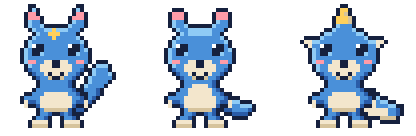

# マスコット（名前未定）

このリポジトリの相棒キャラクター。**ドット絵・青ベースの動物**という方向で進行中。
名前はまだ決めていないので、ファイル名は暫定のもの（`sprite_a_wolf` など）を使っています。



左から **A. とがり耳**／**B. まる耳**／**C. 角つき**。
顔と体つきは共通で、耳・しっぽ・頭の飾りだけを変えた同じ子の3案です。

## 3案

| | A. とがり耳 | B. まる耳 | C. 角つき |
| --- | --- | --- | --- |
| 動物のイメージ | オオカミ／キツネの子 | カワウソ／クマの子 | 小さな獣竜 |
| しっぽ | ふさふさ、上に立つ | 平たいパドル | 太い爬虫類しっぽ |
| 頭 | ひたいに金の星 | つるんとした青 | 金の角 |
| 体の横 | なし | なし | ヒレ |
| 印象 | 俊敏・配達っぽい | おっとり・愛嬌 | いちばん「デジモン」寄り |
| ファイル | `pixel/sprite_a_wolf.txt` | `pixel/sprite_b_otter.txt` | `pixel/sprite_c_horn.txt` |

## 決まっていること

- **ドット絵。** 32×32、1文字=1ピクセルのテキストが原本。
- **青ベース。** メインは `#4A90D9`、影に濃紺、ハイライトに水色。
- **おなか・マズル・手足の先はクリーム色。** 青一色にしないことで輪郭が読みやすくなる。
- **差し色は金 `#FFD05C` を1箇所だけ。** 星でも角でも、光っているところが「反応している」合図になる。
- **輪郭は黒ではなく濃紺 `#16213E`。** 青となじませるため。

## 決まっていないこと

- 名前（候補は下記）
- どの案で進めるか（A / B / C、または耳はAでしっぽはB、といった組み合わせも可）
- 性格・口調・設定

### 名前の候補

| 候補 | 由来 |
| --- | --- |
| ルリモン | 瑠璃（るり）。深い青の宝石。 |
| ナギモン | 凪。静かな海の青。 |
| アイモン | 藍。日本の青。 |
| シオモン | 潮。流れて運ぶイメージ。 |
| コバモン | コバルトブルー。 |

## カラーパレット

`pixel/palette.json` が定義ファイル。グリッドの1文字がそのまま1色。

| 文字 | 用途 | HEX |
| --- | --- | --- |
| `.` | 透過 | — |
| `#` | 輪郭 | `#16213E` |
| `D` | 影の青 | `#2A5CA8` |
| `B` | ベースの青 | `#4A90D9` |
| `L` | ハイライトの水色 | `#8FCBF5` |
| `C` | クリーム | `#F3E6CC` |
| `S` | クリームの影 | `#D6C39C` |
| `W` | 白（目の光） | `#FFFFFF` |
| `Y` | 差し色の金 | `#FFD05C` |
| `P` | 耳の内側・ほお | `#FF9CA8` |

## 描き方・書き出し方

原本は `pixel/*.txt`。テキストエディタで1文字ずつ直接編集できます。
色を変えたいときは `palette.json` の HEX を書き換えるだけで全スプライトに反映されます。

```bash
# 全グリッドを等倍と x8 で PNG に書き出す
python3 character/pixel/render.py

# 1枚だけ、倍率を指定して
python3 character/pixel/render.py character/pixel/sprite_a_wolf.txt -s 16
```

`render.py` は標準ライブラリだけで動きます（Pillow 不要）。

## 次にやること

1. A / B / C のどれで進めるか決める
2. 名前を決める
3. 表情・ポーズ差分を足す（`通常` / `どや顔＝投稿成功` / `しょんぼり＝エラー` / `寝ている＝キュー空`）
4. 投稿用のアイコン切り出し（顔アップ 16×16 と 32×32）

## 過去案

`drafts/` に最初に描いたベクター版（テラコッタ色の毛皮をかぶった子）が入っています。
色も画材も今の方向とは違うので、参考として置いてあるだけです。
