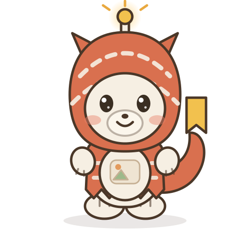

# ツギモン / Tsugimon

> 「つぎの一枚、ぼくが運ぶヨ。」

`feed-auto-media` の相棒キャラクター。
デジモンの「毛皮をかぶった小さな相棒」という原型（ガブモン）への**オマージュ**として設計した、
完全オリジナルのマスコットです。



---

## プロフィール

| 項目 | 内容 |
| --- | --- |
| 名前 | ツギモン（Tsugimon）／由来は「次（つぎ）」＝次の投稿 |
| 世代 | 成長期 |
| 種族 | 配信獣型 |
| 属性 | データ種 |
| 身長 | 92cm（フードの角を除く） |
| 好物 | 焼きたての下書き（まだ誰にも見せていない画像） |
| 必殺技 | シグナルブレス／ポストショット |

## 見た目のルール

キャラを描き足す・差分を作るときは、この3点だけ守れば「ツギモンらしさ」が保てます。

1. **毛皮のフードは脱がない。** テラコッタ色の毛皮をすっぽりかぶっている。
   中身は誰も見たことがない（本人いわく「まだ公開設定じゃないから」）。
2. **頭の角はアンテナ。** 先端の金色の玉が光っていると「受信中／次の投稿を思いついた」の合図。
   しょんぼりすると光が消える。
3. **しっぽの先はしおり型のフラグ。** 「ここから次」を指す目印。
   投稿が予約済みのときはピンと立ち、キューが空だと垂れる。

その他の特徴：毛皮の模様は破線（＝データの流れ）。
お腹にはフィードの紋章（写真アイコン）が浮かんでいて、ここに新しい画像が一瞬映る。

## カラーパレット

| 用途 | 色 | HEX |
| --- | --- | --- |
| 毛皮（メイン） | テラコッタ | `#D9704F` |
| 地肌・お腹 | クリーム | `#F6EFE3` |
| 線画 | ダークブラウン | `#4A3728` |
| 角の光・フラグ | ゴールド | `#F2C14E` |
| ほお | コーラル | `#E8836A` |
| 紋章の緑 | セージ | `#9DB98A` |
| 背景（アイコン） | ウォームサンド | `#FCEFE0` |

## 性格・口調

極度の人見知りで、初対面ではフードを深くかぶって後ずさりする。
でも「これ任せた」と言われた瞬間だけスイッチが入り、頼まれた一枚を届けきるまで絶対に諦めない。
自分の作ったものを見せる直前がいちばん緊張する（毎回フラグをいじる癖がある）。

- 一人称：ぼく
- 語尾：「〜だヨ」「〜かナ」
- 口癖：「まだ下書きだけど……見る？」

## 進化ライン

| 世代 | 名前 | ひとこと |
| --- | --- | --- |
| 幼年期 | ドットモン | 1ピクセルの点。まだ何も表示できないが、ぴかぴか光って存在を主張する。 |
| 成長期 | **ツギモン** | 毛皮をかぶり、初めて「届ける」ことを覚えた姿。本作の主役。 |
| 成熟期 | ツタエモン | 毛皮がマントに伸び、紙の翼で遠くまで運ぶ配達獣。 |
| 究極体 | ヒビキモン | 背中にリングアンテナを持ち、届けた声の反響まで受け取れるようになった姿。 |

## 必殺技

- **シグナルブレス** — 頭の角に溜めた電波を一息に吹き出し、届かなかった相手にもう一度届ける。
- **ポストショット** — しっぽのフラグを投げつける。刺さった場所が「次の投稿位置」になる。
- **マナーモード**（特殊）— 怖くなるとフードに引っ込んで通知を全部切る。防御技だが、本人は技だと認めていない。

## このリポジトリでの使いどころ

- `tsugimon-icon.svg` … 投稿アカウントのアバター、README のバッジ
- `tsugimon.svg` … before / after 比較画像の案内役、生成結果の見出し画像
- 将来的に作ると便利な差分：`通常` / `どや顔（投稿成功）` / `しょんぼり（エラー）` / `寝ている（キュー空）`
  ログの状態に合わせて画像を差し替えると、フィードの様子が一目で分かる。

## ファイル

| ファイル | 用途 | サイズ |
| --- | --- | --- |
| `tsugimon.svg` | 全身・基本立ち絵 | 512×512（背景透過） |
| `tsugimon-icon.svg` | 顔アップのアイコン | 256×256（背景あり） |

SVG なのでどの解像度にも拡大できます。PNG が必要なときは：

```bash
pip install cairosvg
python3 -c "import cairosvg; cairosvg.svg2png(url='character/tsugimon.svg', write_to='tsugimon.png', output_width=1024, output_height=1024)"
```

## 注記

ツギモンはこのリポジトリのために描き起こしたオリジナルキャラクターです。
「小さな生きものが毛皮をかぶっている」という着想の元としてガブモン（デジモン）を参照していますが、
デザイン・名前・設定はいずれも既存作品の複製ではありません。
