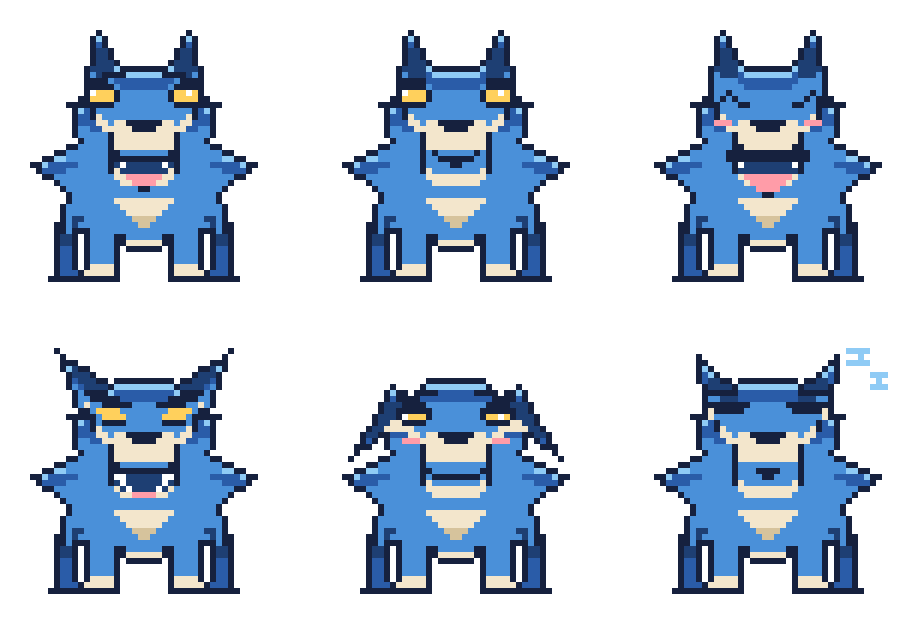
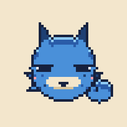
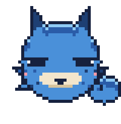
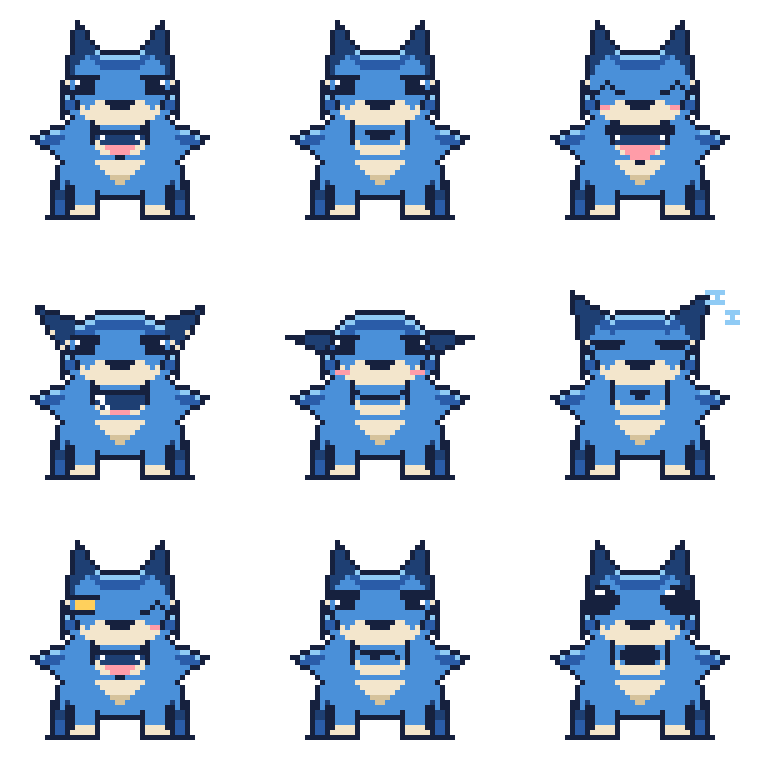

# ロウ

このリポジトリの相棒キャラクター。青い狼のドット絵です。



## 名前

**ロウ** — 狼の音読みから。

検討した候補：ルリ（瑠璃）／ナギ（凪）／アイ（藍）／シオ（潮）／コバ（コバルト）、
語尾に「モン」を付ける案（ルリモン／ナギモン／ソウガモン）。
青の色名から取る案が多かったなかで、種そのものを名前にする案を採りました。
1音で呼べて、`rou` とファイル名にしても短いのが決め手です。

## 姿（40×40）

1頭身。頭がそのまま体で、手足は付けず、耳と丸いしっぽだけが生えています。

| ファイル | 表情 | フィードでの使いどころ |
| --- | --- | --- |
| `pixel/rou.txt` | 通常（既定） | 待機中 |
| `pixel/rou_bark.txt` | 吠える | 投稿した瞬間 |
| `pixel/rou_happy.txt` | 喜び | 投稿成功 |
| `pixel/rou_angry.txt` | 怒り | エラー・失敗 |
| `pixel/rou_sad.txt` | しょんぼり | 投稿スキップ |
| `pixel/rou_sleep.txt` | 寝ている | キューが空 |
| `pixel/rou_wink.txt` | ウインク | 予約完了 |
| `pixel/rou_smug.txt` | どや顔 | 連続投稿の達成 |
| `pixel/rou_surprise.txt` | 驚き | 想定外の入力 |

## 崩さないルール

### 丸く見せる

丸く見せるのに効くのは、輪郭を丸く描くことではなく
**輪郭を四角くしている物を探して外すこと** でした。真円で描いていても、
次の3つが左右と底を平らにします。

1. **首の毛が胴を四角くする。** 毛のかたまりを頭と同じ大きさにすると、
   下半分の左右が壁になります。毛は下半分だけ・小さめに。
2. **耳の付け根が広すぎる。** 付け根を2px 詰めるだけで頭の上が丸くなります。
3. **足を下に並べると底が平らになる。** 手足を外したことで底が素直に丸くなりました。

顔のパーツは頭の下半分に寄せます。中央より上に置くと、同じ絵でも一気に大人びます。
しっぽは頭の後ろだと完全に隠れるので、右下に丸い毛玉として出しています。

### 目

**ジト目**（まぶたの帯＋その下の目）が基準です。色は輪郭と同じ濃紺。
白のハイライトを1px 必ず残します。これがないと帯と一体化して目が消えます。

まぶたの帯はどの表情でも残し、**傾きだけ**変えます。

| 表情 | まぶたの帯 |
| --- | --- |
| 通常・吠える・ウインク | 水平 |
| 怒り | 内側（鼻側）が下がる |
| しょんぼり | 外側が下がる |
| どや顔 | 2px に厚くする |
| 驚き | **外す**（唯一の例外。残すと見開いて見えない） |
| 喜び・寝ている | 目を閉じるので帯なし |

### 耳

耳は手で描き直さず、**立てた耳のベクトルを回して**作ります。
頭の大きさを変えても耳が浮きません。

| 耳 | 回転 | 使う表情 |
| --- | --- | --- |
| 立てる | 0° | 通常・吠える・喜び・ウインク・どや顔・驚き |
| 少し寝かせる | -25° | 寝ている |
| 後ろに寝かせる | -45° | 怒り |
| 垂らす | -72° | しょんぼり |

表情を分けるのは、目の形よりも **耳の角度** のほうが効きます。

### 毛をふさふさに見せる

輪郭そのものをギザギザにするのが要点で、内側に線を引くだけでは毛に見えません。

1. 首を包む丸い土台を置く
2. 毛束を **独立した三角形** として重ねる。根元を土台の内側まで数px 食い込ませる
   （離すと穴が空く）。1房は根元・長さとも5〜6px。小さいと輪郭線に埋もれて消える
3. かたまりの中心から毛先へ1pxの線を引く（区間は 30〜78%。端まで引くと潰れる）
4. 上側の1px を `L` で光らせる

**房は少なく大きく。** 1頭身では片側2つまで。増やすと1房が痩せて団子になります。

## カラーパレット

`pixel/palette.json` が定義ファイル。グリッドの1文字がそのまま1色です。

| 文字 | 用途 | HEX |
| --- | --- | --- |
| `.` | 透過 | — |
| `#` | 輪郭・目 | `#16213E` |
| `N` | 耳の内側・口の中 | `#1E3F73` |
| `D` | 影の青 | `#2A5CA8` |
| `B` | ベースの青 | `#4A90D9` |
| `L` | 上からの光 | `#8FCBF5` |
| `C` | マズル | `#F3E6CC` |
| `S` | クリームの影 | `#D6C39C` |
| `W` | 目の光 | `#FFFFFF` |
| `P` | ほお・舌 | `#FF9CA8` |
| `Y` | （未使用） | `#FFD05C` |

金（`Y`）は目の色に使っていましたが、輪郭と同じ濃紺に統一したため未使用です。
差し色を戻したくなったときのために残してあります。

暖色は舌とほおだけ。青いキャラに模様を足すときは、
**暗くするのではなく明るくする** ほうが確実に見えます
（濃紺で隈取りを入れる案は、地の青と明度が近く小さく表示するとほぼ消えました）。

## 描き方・書き出し方

原本は `pixel/*.txt`。1文字=1ピクセルなので、テキストエディタで直接描き換えられます。
色を変えたいときは `palette.json` の HEX を書き換えるだけで全スプライトに反映されます。

```bash
# 全グリッドを等倍と x8 で PNG に書き出す
python3 character/pixel/render.py

# 1枚だけ、倍率を指定して
python3 character/pixel/render.py character/pixel/rou.txt -s 16

# ターミナルにロウを出す
python3 character/pixel/show.py
python3 character/pixel/show.py happy
python3 character/pixel/show.py --list

# 正方形のアイコンを書き出す（512/256/128/64）
python3 character/pixel/icon.py
python3 character/pixel/icon.py --bg none -s 512    # 透過
python3 character/pixel/icon.py happy               # 表情を指定
```

`render.py` も `show.py` も `icon.py` も標準ライブラリだけで動きます（Pillow 不要）。
`show.py` は半角1マスに縦2ピクセルを詰めるので、端末でもドットがほぼ正方形に見えます。
`NO_COLOR` が設定されているか、出力先が端末でないときは何も出しません。

## アイコン



`pixel/icons/` に 512 / 256 / 128 / 64 を置いてあります。背景はパレットのクリーム
（`--bg white` / `--bg navy` / `--bg none` も選べます）。

2点だけ気をつけています。

- **拡大は必ず整数倍。** 中途半端な倍率だとドットがにじみます。
  `icon.py` はサイズから自動で整数倍を選びます。
- **横の中心は頭で取る。** しっぽまで含めて中央に置くと、顔が左に寄って見えます。
  スプライトの上60%だけを見て中心を決めています。

## アニメーション



| ファイル | 中身 | 使いどころ |
| --- | --- | --- |
| `pixel/anim/rou_idle.gif` | たまにまばたきする | 待機中 |
| `pixel/anim/rou_bark.gif` | ひと吠え | 投稿した瞬間 |
| `pixel/anim/rou_hop.gif` | 跳ねて喜ぶ | 投稿成功 |
| `pixel/anim/rou_sleep.gif` | 寝息で上下する | キューが空 |

```bash
python3 character/pixel/anim.py              # 全部を書き出す
python3 character/pixel/anim.py idle -s 8    # 1本だけ、倍率を指定
python3 character/pixel/show.py --anim bark  # 端末で再生（Ctrl-C で止める）
```

GIF は標準ライブラリだけで組み立てています（LZW も自前）。

コマは `anim.py` の `ANIMATIONS` に **（元のグリッド, 表示時間, 上下のずれ）** で並べるだけです。
跳ねる動きは絵を描き足さずに、同じ絵を数px 上にずらして作っています。
新しい動きを足すときも、まず「ずらすだけで作れないか」を試すのが早いです。

まばたきは `rou_blink.txt`（閉じ）と `rou_half.txt`（半開き）の2枚だけ描き足しました。
閉じるときも開くときも半開きを挟むと、2枚でもぱちくりして見えます。

## これまでの形

同じパレット・同じ目で描いた別の姿も残してあります。

| ファイル | 内容 | サイズ |
| --- | --- | --- |
| `pixel/rou_front*.txt` | 2頭身・正面（表情9種） | 48×48 |
| `pixel/rou_quad.txt` | 四足・横向きの立ち姿 | 48×40 |
| `pixel/rou_head.txt` | 四足版の横顔アップ | 26×26 |
| `pixel/rou_chibi.txt` | 初期のデフォルメ | 32×32 |



四足の横向きは、首の毛が輪郭の片側にしか出ないぶん正面より落ち着いて見えます。

## 検討案

採用しなかった案も `drafts/pixel/` に残してあります。

| シート | 内容 |
| --- | --- |
| `drafts/pixel/eyes_jito.png` | ジト目 6案（採用） |
| `drafts/pixel/eyes_b.png` | 目・系統違い 6案 |
| `drafts/pixel/eyes.png` | 目・第1案 6案 |
| `drafts/pixel/face_designs.png` | 顔立ち 6案 |
| `drafts/pixel/front_shapes.png` | 体つき 6案 |

`drafts/tsugimon.svg` は最初に描いたベクター版（テラコッタ色の毛皮）。
色も画材も今の方向とは違うので、参考として置いてあるだけです。
