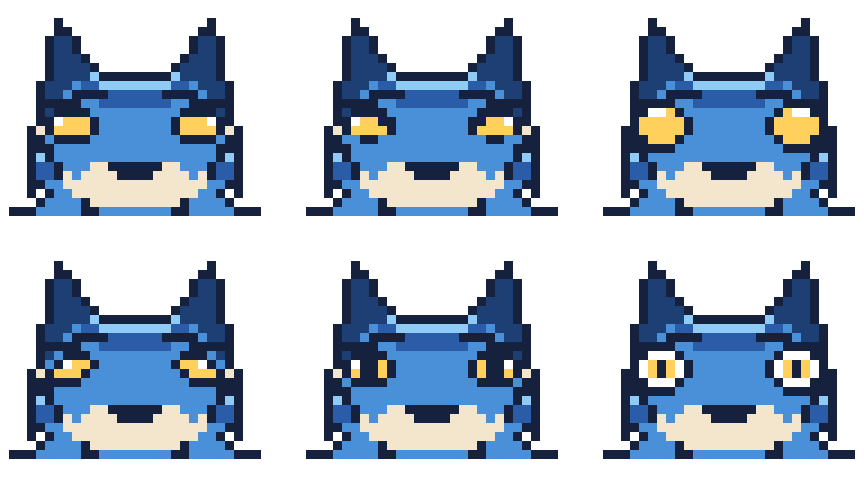

# マスコット（名前未定）

このリポジトリの相棒キャラクター。
**青ベースの狼／ドット絵／四足歩行／凛々しい立ち姿** で進行中。名前はまだ決めていません。


## 本命：四足の狼（48×40）

`pixel/sprite_wolf_quad.txt`

- **頭を背中より高く保った立ち姿。** うつむかせない。凛々しさはほぼこの一点で決まる。
- **金の目。** 差し色の金 `#FFD05C` は目だけに使う。顔の中でいちばん最初に目がいく。
- **耳は立てる。** 伏せると途端に弱く見える。
- **しっぽは上げる。** 垂らすと警戒・服従の姿勢になってしまう。
- **背中は水平に近く、腰でわずかに落ちる。** 背が丸まると老いて見える。
- **首まわりは毛でふくらませる。** 下記のルールで、頭より太い毛のかたまりを作る。

## 毛をふさふさに見せる4つの手順

ドット絵で毛を表現するとき、いちばん効くのは **輪郭そのものをギザギザにすること** です。
内側に線を入れるだけでは毛に見えません。首まわりはこの順で作っています。

1. **土台を置く。** 首を包む丸いかたまりを、首の太さの1.5〜2倍で置く。
   この時点ではただの塊でよい。
2. **毛束を独立した三角形として重ねる。**
   のど・のど下・胸・うなじの4方向に、根元を土台の内側まで食い込ませた三角形を置く。
   根元が土台から離れると穴が空くので、必ず数ピクセル重ねる。
   1房は **根元5〜6px・長さ5〜6px** 。これより小さいと輪郭線に埋もれて消える。
3. **毛先へ向かう1pxの線を引く。** かたまりの中心から各毛先へ、`D` と `N` を交互に。
   長さは中心から毛先までの 30%〜78% の区間だけ。端まで引くと輪郭とぶつかって潰れる。
4. **上側の1pxだけ `L` で光らせる。** 毛の上面に光が乗り、かたまりに丸みが出る。

肩へのつながりは、後ろ向きの毛束を2つ **胴の内側に収まる範囲で** 置いて毛先をぼかします。
胴の輪郭線より外に出すと背中のラインが折れて、毛ではなくトゲに見えてしまいます。

しっぽも同じ手順で、外側の縁に3つ毛束を足しています。

## 正面：吠えるポーズ（48×48）

`pixel/sprite_wolf_front.txt`

 

正面は **直立ポーズでは絶対に盛り上がりません**。左右対称で動きがないぶん、
横向きより情報が少なくなるからです。なので正面は吠えている構えにしています。

### 勢いと怖さは別の場所が作っている

ここが今回いちばんの発見でした。
**逆立った毛は「勢い」だけを担当していて、「怖さ」には一切関係しません。**
怖さは全部、顔のパーツが作っています。
つまり毛はワイルドなままでよく、怖すぎるときは顔だけ直せば済みます。

怖くなる要素（マスコットでは避ける）:

| 避ける | 代わりに |
| --- | --- |
| 吊り上がった細い目 | 丸くて大きい金の目 |
| 目に光がない | **白のハイライトを1px入れる**（これだけで一気に怖くなくなる） |
| 中心に向かって急角度で下がる眉 | 下げるのは2pxまで。決意くらいで止める |
| 下向きに突き出た大きな牙 | 牙は小さく、口角を上げる |
| 後ろに寝た耳 | 前に立てる |

テンションを作っているのは次の3つ。この順に効きます。

1. **開いた口と舌。** ピンクの舌は顔の中で唯一の暖色なので、真っ先に目に入る。
2. **外へ跳ねた毛。** 首の毛を放射状の大きな三角3つ（片側）にして、星形のシルエットを作る。
3. **大きな金の目。** 光を1px入れて生きている目にする。

毛は **片側3房まで** 。5房・6房と増やすと1房が3〜5pxまで痩せて、輪郭が団子になります。
「房を増やす」ではなく「房を大きくする」が正解でした。先を平らにして太らせる手も試しましたが、
階段状のギザギザになってかえって汚くなったので、先は尖らせたままにしています。

左右は片側だけ描いて反転（`sym()`）。手で両側を描くと必ずズレます。

`pixel/sprite_wolf_face.txt` はこの正面から顔だけを切り出した 32×32 で、
アイコンにするならこちらのほうが横顔より目を引きます。

## 表情パターン（9種）


体つきは検討案のうち **`chibi`（頭を大きく・脚を短く）** を採用しています。
体と毛は全パターン共通で、**顔のパーツと耳の角度だけ**差し替えています。

| ファイル | 表情 | フィードでの使いどころ |
| --- | --- | --- |
| `pixel/sprite_wolf_front.txt` | 吠える（既定） | 投稿した瞬間 |
| `pixel/sprite_wolf_front_calm.txt` | 通常・口を閉じる | 待機中 |
| `pixel/sprite_wolf_front_happy.txt` | 喜び | 投稿成功 |
| `pixel/sprite_wolf_front_angry.txt` | 怒り | エラー・失敗 |
| `pixel/sprite_wolf_front_sad.txt` | しょんぼり | 投稿スキップ |
| `pixel/sprite_wolf_front_sleep.txt` | 寝ている | キューが空 |
| `pixel/sprite_wolf_front_wink.txt` | ウインク | 予約完了 |
| `pixel/sprite_wolf_front_smug.txt` | どや顔 | 連続投稿の達成 |
| `pixel/sprite_wolf_front_surprise.txt` | 驚き | 想定外の入力 |

### 耳の角度が感情を決める

表情を分けるのに効いたのは、目の形よりも **耳の角度** でした。
顔のパーツを同じにしたまま耳だけ変えても、ちゃんと別の感情に見えます。

耳は手で描き直さず、**立てた耳のベクトルを回して**作っています。
体つきを変えても耳が破綻しないのはこのためです（手で置くと頭の大きさが変わるたびに浮きます）。

| 耳 | 回転 | 使う表情 |
| --- | --- | --- |
| 立てる | 0° | 吠える・通常・喜び・ウインク・どや顔・驚き |
| 少し寝かせる | -25° | 寝ている |
| 後ろに寝かせる | -45° | 怒り |
| 垂らす | -72° | しょんぼり |

| 表情 | 目 | 口 |
| --- | --- | --- |
| 吠える | 丸い金＋光 | 開けて口角を上げる |
| 通常 | 丸い金＋光 | 閉じて口角を上げる |
| 喜び | `^ ^` | 大きく開けて舌を出す・ほお染め |
| 怒り | 細い吊り目 | 牙をむく |
| しょんぼり | 上まぶたを下げる | 口角を下げる・ほお染め |
| 寝ている | 閉じる | 小さく閉じる |
| ウインク | 片目だけ `^` | 開けて口角を上げる |
| どや顔 | 半目 | 片側だけ上がる |
| 驚き | まん丸・瞳を小さく | 縦に丸く開ける |

## 派生

| ファイル | 用途 | サイズ |
| --- | --- | --- |
| `pixel/sprite_wolf_quad.txt` | 本命の立ち姿（横） | 48×40 |
| `pixel/sprite_wolf_front.txt` | 正面・吠えるポーズ | 48×48 |
| `pixel/sprite_wolf_face.txt` | 顔アップ（アイコン向き） | 32×32 |
| `pixel/sprite_wolf_head.txt` | 顔アップ（投稿アカウントのアイコン用） | 24×24 |
| `pixel/sprite_wolf_chibi.txt` | デフォルメ版。同じ狼の幼い姿という位置づけ | 32×32 |

 

## カラーパレット

`pixel/palette.json` が定義ファイル。グリッドの1文字がそのまま1色です。

| 文字 | 用途 | HEX |
| --- | --- | --- |
| `.` | 透過 | — |
| `#` | 輪郭（黒ではなく濃紺） | `#16213E` |
| `N` | 奥の脚・耳の内側 | `#1E3F73` |
| `D` | 背中・影の青 | `#2A5CA8` |
| `B` | ベースの青 | `#4A90D9` |
| `L` | 上からの光 | `#8FCBF5` |
| `C` | 腹・のど・脚先のクリーム | `#F3E6CC` |
| `S` | クリームの影 | `#D6C39C` |
| `W` | 白（牙） | `#FFFFFF` |
| `Y` | 金（目だけ） | `#FFD05C` |
| `P` | 差し色の桃（デフォルメ版の耳の内側） | `#FF9CA8` |

明暗は上から下へ **`L` → `D` → `B` → `C` → `S`**。背が濃く腹が明るい、という動物の基本に合わせています。

## 名前の候補

| 候補 | 由来 |
| --- | --- |
| ルリオオカミ／ルリガミ | 瑠璃。深い青。 |
| ナギロウ | 凪 + 狼。静かな海の青。 |
| アイロウ | 藍 + 狼。 |
| ソウガ | 蒼牙。 |
| ハクロウ | 白狼。青に白の差し色という見た目から。 |

デジモン風に「〜モン」を付けるなら **ルリモン／ナギモン／ソウガモン** あたり。

## 描き方・書き出し方

原本は `pixel/*.txt`。1文字=1ピクセルなので、テキストエディタで直接描き換えられます。
色を変えたいときは `palette.json` の HEX を書き換えるだけで全スプライトに反映されます。

```bash
# 全グリッドを等倍と x8 で PNG に書き出す
python3 character/pixel/render.py

# 1枚だけ、倍率を指定して
python3 character/pixel/render.py character/pixel/sprite_wolf_quad.txt -s 16
```

`render.py` は標準ライブラリだけで動きます（Pillow 不要）。

## 次にやること

1. 名前を決める
2. ポーズ差分（伏せ／遠吠え／走り）
3. 表情や状態の差分（投稿成功／エラー／キュー空）
4. 走りの2〜4コマアニメーション

## 目の検討案（6種）



目以外は全部同じにして、目だけ変えた比較用です（顔を切り出して拡大しています）。
`drafts/pixel/eye_*.txt`。

| 案 | 目 | 印象 |
| --- | --- | --- |
| `round` | 現行。金ベタ＋白の光1px | 素直、扱いやすい |
| `sharp` | 細く吊って内側の角を落とす | 精悍、鋭い |
| `big` | 一回り大きい丸 | かわいい、幼い |
| `soft` | 外側が下がるたれ目 | やさしい、穏やか |
| `cat` | 縦に細い瞳 | 野性的、獣らしい |
| `sclera` | 白目あり＋金の虹彩＋黒い瞳 | キャラクター寄り、視線が出る |

目は **左目だけ定義して自動で反転** させています（`eye_pair()`）。
手で左右を置くと1pxずれて寄り目になるので、必ず片側だけ書きます。

瞳を入れる案も試しましたが、虹彩の中に3px幅の黒を置くと金が輪っかになって
ドーナツのように見えました。瞳を入れるなら `cat` の縦1〜2pxか、`sclera` のように
白目を足して虹彩を小さくするほうが成立します。

## 顔立ちの検討案（6種）


体つきと表情（吠える）は揃えて、**顔のパーツそのもの**を変えた比較用です。
`drafts/pixel/face_design_*.txt`。

| 案 | 変えたところ | 印象 |
| --- | --- | --- |
| `A_now` | 現行（丸い金の目） | 素直、扱いやすい |
| `B_sharp` | 細く吊った目＋頬の毛を尖らせる | 精悍、野性的 |
| `C_big` | 目を一回り大きく丸く | かわいい、親しみ |
| `D_brow` | 目の上にクリームの斑（眉斑） | 表情が読みやすい、狼らしい |
| `E_blaze` | 額から鼻筋にクリームの線 | 個体識別しやすい、印象に残る |
| `F_fluff` | 頬に毛の房を追加 | もふもふ、丸い |

顔の模様（`D` `E`）は **クリームで入れると確実に見えます**。
濃紺で隈取りを入れる案も試しましたが、地の青と明度が近く、小さく表示するとほぼ消えました。
青いキャラに模様を足すなら、暗くするのではなく明るくするほうが効きます。

模様（`D` `E`）と頬の毛（`B` `F`）と目のかたち（`A` `B` `C`）は独立しているので、
「`C` の目に `E` の鼻筋」のような組み合わせも作れます。

## 体つきの検討案（6種）


顔（吠える）は揃えて、**毛量と体つきだけ**変えた比較用です。`drafts/pixel/front_shape_*.txt`。

| 案 | 内容 | 向いている印象 |
| --- | --- | --- |
| `base` | 現行 | バランス型 |
| `fluffy` | 毛束4本・毛のかたまりを最大に | もふもふ、存在感 |
| `clean` | 毛束2本・毛を最小に | すっきり、アイコン向き |
| `chibi` | 頭を大きく・脚を短く | かわいい、親しみ |
| `sharp` | 耳を高く・細身・脚を長く | 精悍、スピード感 |
| `heavy` | 胴を太く・腰を広く | どっしり、力強い |

小さく表示するほど `clean` が読みやすく、大きく表示するほど `fluffy` が映えます。
アイコンと投稿画像で使い分けるのも手です。

## 過去案

`drafts/` に以前の案が入っています。

- `tsugimon.svg` / `tsugimon-icon.svg` … 最初のベクター版（テラコッタ色の毛皮）
- `pixel/sprite_b_otter.txt` / `pixel/sprite_c_horn.txt` … デフォルメ3案のうち採用しなかった2案
