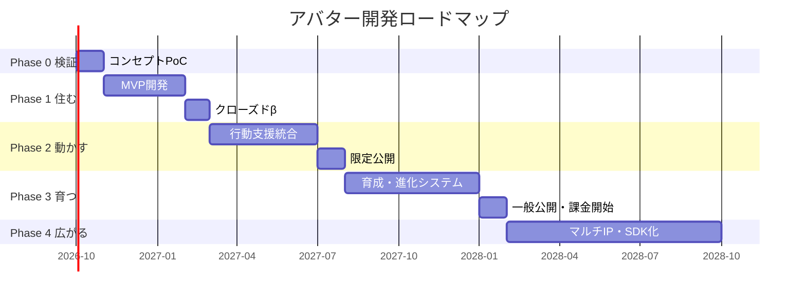

# アバター開発ロードマップ（24ヶ月）

**御社の事業として**立ち上げる前提のロードマップです。
「デスクトップに**住む**」→「**動かす**」→「**育つ**」→「**広がる**」の4段階で積み上げます。

各 Phase の終わりに **Go / No-Go 判断ポイント**を置いています。
判断するのは御社です。Phase 0 の実機を見てから Phase 1 を決める、という進め方を想定しています。

> 表記について: 「御社」＝開発・販売の主体。「当社」＝Addness の供給と技術支援を行う【自社名】。
> 座組み A案（エンジン供給型）を前提に書いています。B案（内製化支援型）の場合、
> Phase 0〜1 の実装主体が当社に入れ替わり、Phase 2 以降で御社へ移管します。

---

## 全体像



| Phase | 期間 | テーマ | ひとことで | 判断ポイント |
|---|---|---|---|---|
| **0** | 1ヶ月 | 検証 | 動くものを見る | 続けるか |
| **1** | 4ヶ月 | 住む | 画面にいる | ファンが常駐させ続けるか |
| **2** | 5ヶ月 | 動かす | 生活が変わる | 課金意思があるか |
| **3** | 6ヶ月 | 育つ | 手放せない | 事業として成立するか |
| **4** | 8ヶ月 | 広がる | 他IPへ展開 | プラットフォーム化するか |

---

## Phase 0 ｜ コンセプト検証PoC（1ヶ月）

**目的**: 「画面の中でキャラクターが生きている」感覚が本当に成立するかを、資料ではなく実機で確認する。

> 当社オリジナルキャラクター「ロウ」による参考機を先にご覧いただけます。
> **御社のIPをお預かりする前に、同じ手順で作られたものを確認できます。**
> 【要確認: ロウの実装状況に合わせて記述を確定すること】

| | |
|---|---|
| 期間 | 3〜4週間 |
| 対象 | キャラクター **1体** |
| プラットフォーム | Windows のみ |
| 御社の工数 | 会議3回（各60分）＋設定資料の提供 |

### やること
- キャラクター1体をデスクトップに常駐表示（透過ウィンドウ、常に手前）
- 待機モーション3種＋クリック反応2種
- 「おはよう」「おつかれ」など**監修済み固定セリフ**のみで会話（この段階ではLLM生成を使わない）
- Addness との接続確認（当日のタスク1件を読み上げる）

### やらないこと
- 自由対話 / 課金 / 育成 / Mac対応 / マルチキャラ

### 成果物
1. 実行可能なWindowsビルド（御社PCで動かせる）
2. 技術検証レポート（性能・消費リソース・実装リスク）
3. Phase 1 の詳細見積と仕様書

### Go / No-Go の基準
- 御社の監修担当者が「このキャラクターらしい」と判断できているか
- 通常業務の裏で常駐させても邪魔にならないか（CPU/メモリ/視界）

---

## Phase 1 ｜ 住む（4ヶ月）

**目的**: 毎日起動され、消されないこと。「かわいい」ではなく「いて当たり前」を作る。

### 開発スコープ

| 領域 | 内容 |
|---|---|
| 表示 | VRM対応レンダラ、ウィンドウ追従、マルチモニタ対応 |
| モーション | 待機8種・反応6種・移動・ウィンドウへの着座 |
| 音声 | ボイス再生基盤（既存収録音源の利用 or 新規収録）【要協議】 |
| 対話 | 定型セリフ＋軽量な生成応答（人格プロンプト＋二段フィルタ） |
| Addness連携 | 当日のタスク表示、リマインド通知をキャラが伝える |
| 設定 | 常駐位置・サイズ・音量・出現頻度・おやすみモード |
| 基盤 | 自動更新、クラッシュレポート、利用ログ（同意ベース） |

### 監修プロセスの確立（Phase 1 の隠れた本命）
- 口調レギュレーションを構造化データ化（一人称・語尾・呼称・NG表現）
- 週次の差分レビュー会（30分）
- ステージング環境で御社が承認したものだけが本番へ

### クローズドβ（4ヶ月目）
- 参加者 **200〜500名**【要調整】
- 計測: 7日継続率、14日継続率、1日あたり起動時間、アンインストール理由

### Go / No-Go の基準
| 指標 | 目標 |
|---|---|
| 7日継続率 | 50%以上 |
| 14日継続率 | 35%以上 |
| 1日平均常駐時間 | 3時間以上 |
| 「キャラが壊れている」報告 | 0件 |

---

## Phase 2 ｜ 動かす（5ヶ月）

**目的**: ユーザーの生活に実利を出す。ここで初めて「マスコット」から「相棒」になる。

### 開発スコープ

| 領域 | 内容 |
|---|---|
| 目標対話 | 「今月これをやりたい」を会話で受け取り、中期・短期に自動分解 |
| 進捗管理 | 達成の記録、詰まりの検知、翌日への繰り越し提案 |
| 文脈理解 | カレンダー連携、PC利用状況（アプリ種別のみ・画面内容は取得しない） |
| 介入設計 | 声をかける／黙る の判断。**うるさくないこと**が最重要KPI |
| 振り返り | 1日の終わりと週末のサマリー（キャラの口調で） |
| 人格深化 | 関係性パラメータ。日数に応じて距離感と呼び方が変わる |
| Mac対応 | macOS版リリース |

### プライバシー設計（先方の必須確認項目）
- **画面のキャプチャ・内容解析は行わない**
- 取得するのは「アクティブなアプリの種別」「入力の有無」程度
- 行動ログの保存先・保持期間・削除手段をUIから明示
- すべてオプトイン。拒否しても基本機能は動く

### 限定公開（5ヶ月目）
- 5,000〜20,000名規模【要調整】
- 課金意思調査（実課金ではなくアンケート＋事前登録）

### Go / No-Go の基準
| 指標 | 目標 |
|---|---|
| 30日継続率 | 25%以上 |
| 「行動が変わった」と回答 | 40%以上 |
| 課金意思あり | 15%以上 |
| 通知が「うるさい」 | 10%未満 |

---

## Phase 3 ｜ 育つ（6ヶ月）

**目的**: 収益化と、離脱不能性。**ここが『デジタルモンスター』の原体験の現代版**にあたります。

### 育成・進化システム

```
[実生活の達成]  →  [成長パラメータ]  →  [進化]
  タスク完了          活力
  継続ログイン        絆
  早起き              規律          → 分岐条件を満たすと
  振り返り実施        内省             見た目・声・性格が変化
```

**設計原則**
- 進化条件は **ユーザーの実生活の記録**。課金では買えない
- 分岐進化により、同じ初期キャラでも育ち方が人によって変わる
- **退化・別れを入れるかは御社判断**（IPの世界観に直結するため）

### 収益化

| 商品 | 内容 | 想定価格【要調整】 |
|---|---|---|
| 追加キャラクター | 作品内の他キャラを解放 | ¥1,200〜2,500 |
| 衣装・スキン | 季節・作品衣装 | ¥400〜900 |
| ボイスパック | 追加セリフ・記念日ボイス | ¥600〜1,500 |
| プレミアム | 高度な行動支援、複数キャラ同時常駐 | 月額 ¥500〜980 |

### 一般公開（6ヶ月目）
- ストア公開（Steam / 自社配信 / 各種ストア）【要調整】
- 新作・イベントと連動したローンチ設計を御社と共同で

### Go / No-Go の基準
| 指標 | 目標 |
|---|---|
| 課金転換率 | 5%以上 |
| 月次解約率 | 8%未満 |
| 90日継続率 | 15%以上 |
| 月次売上 | 【要調整: 損益分岐点を記入】 |

---

## Phase 4 ｜ 広がる（8ヶ月）

**目的**: 1作品のアプリから、**複数IPが乗るプラットフォーム**へ。ここで資産価値が跳ねます。

### 展開の方向

1. **マルチIP対応**
   - 御社の他作品キャラクターを順次追加
   - 同時常駐・キャラ同士の掛け合い

2. **キャラクターSDK**
   - 他社IPが自社キャラを乗せられるツールキット
   - 御社はプラットフォーム側としてレベニューを得る立場になる

3. **法人向けプラン**
   - 企業の従業員支援ツールとしての導入
   - キャラクターが社内の目標管理を担当する

4. **デバイス展開**
   - スマートフォン、スマートディスプレイ、車載
   - 「どこに行ってもあの子がいる」状態

5. **既存事業との接続**
   - アプリ内からの新作告知・配信送客・EC・イベント連動
   - 玩具/カードとのIDリンク【要協議】

### Go / No-Go の基準
- Phase 3 のユニットエコノミクスが黒字で安定しているか
- 他社IPからの引き合いが実際にあるか

---

## 体制とコストの推移【要調整: 実単価で作り直すこと】

### A案（エンジン供給型）＝ 御社が開発主体

| Phase | 御社の開発体制 | 当社の関与 | 当社への支払い |
|---|---|---|---|
| 0 | 1〜2名（または当社が代行） | PoC実装・技術検証 | ¥1.5M〜 ／ 当社負担も可 |
| 1 | 4〜5名 | Addness供給・設計支援・週次レビュー | エンジンライセンス＋支援フィー |
| 2 | 6〜8名 | 同上＋行動支援ロジックのチューニング | 同上 |
| 3 | 8〜10名 | 同上＋運用設計支援 | 同上 |
| 4 | 10名〜 | エンジン供給の継続 | ライセンスのみ |

**この案では、Phase 1 以降の開発費は御社の内部コストとなり、売上は全額御社に入ります。**

### B案（内製化支援型）＝ 当社が作り、御社へ渡す

| Phase | 実装主体 | 移管状況 | 概算開発費 |
|---|---|---|---|
| 0 | 当社 | — | ¥1.5M〜 |
| 1 | 当社 | 設計書・コードを御社へ共有 | ¥18M〜 |
| 2 | 当社＋御社 | 御社エンジニアが参画開始 | ¥30M〜 |
| 3 | 御社＋当社 | 運用主体が御社へ移る | ¥40M〜 |
| 4 | 御社 | 移管完了。当社はエンジン供給のみ | ライセンスのみ |

**B案でも売上は全額御社のものです。** 当社の対価は開発費と移管支援フィーです。

> 御社に開発リソースがすぐ確保できない場合は B で始め、
> Phase 2〜3 で内製へ寄せていく形が最も現実的だと考えています。

---

## リスクと打ち手

| リスク | 影響 | 打ち手 |
|---|---|---|
| キャラクター表現の毀損 | 致命的 | 定型セリフ優先・二段フィルタ・御社の停止権を契約に明記 |
| 生成AIへのファンの反発 | 大 | 「監修済み公式」であることを前面に。学習データの扱いを公開 |
| 声優・音源の権利 | 大 | 収録済み音源の利用範囲を事前に整理。合成音声は使わない/使う場合は同意取得 |
| 常駐アプリの性能問題 | 中 | Phase 0 で計測。軽量モードを標準搭載 |
| プライバシーへの懸念 | 中 | 画面内容を一切取得しない設計。第三者監査も検討 |
| 競合の先行（Desktop Mate 等） | 中 | 差別化は「行動支援」と「実生活連動の育成」。見た目では勝負しない |
| Addness 側の仕様変更 | 中 | 連携部分を抽象化し、依存を局所化 |

---

## まずは Phase 0 から

このロードマップは24ヶ月分ありますが、**いまお願いしたいのは最初の1ヶ月だけ**です。
Phase 0 の実機を見てから、続きを判断していただければと思います。

そして繰り返しになりますが、**このロードマップの主語は御社です。**
当社は中身（Addness）と作り方（Claude Code）をお渡しする立場で、
出来上がる事業は御社のものです。
